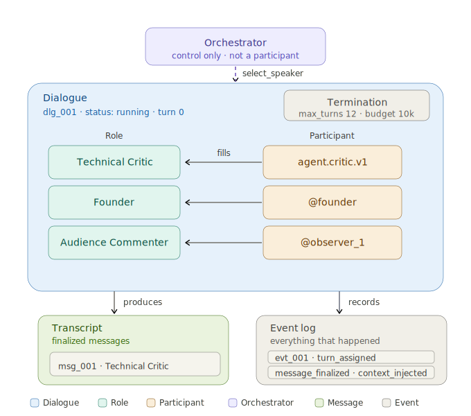
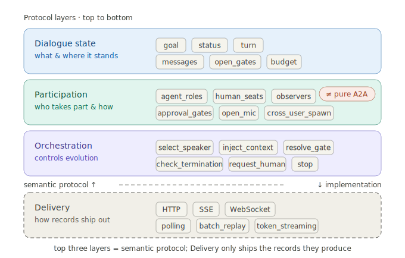
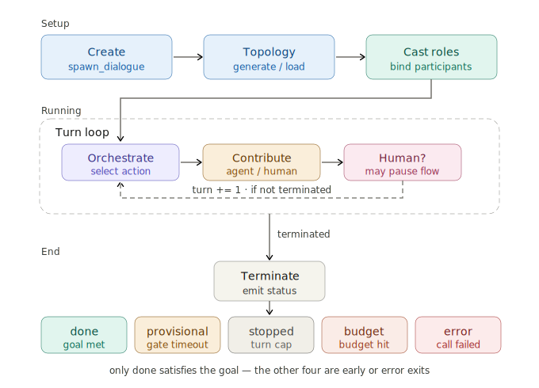

# Design Overview

The whole map, at concept level. This is the mental model behind the SDK; once it clicks, every
other doc is a detail of one box below. The normative source is [`SPEC.md`](../SPEC.md) (section
references `§` point into it); this page is the readable companion.

## What DCP is

A DCP dialogue is a **single serialized transcript** that many participants — agents *and* humans —
contribute to, one turn at a time, under the control of an **orchestrator** that is *not* itself a
participant. The orchestrator does two jobs at once (§1.7):

- **Control** — decide who speaks next, inject context, route for revision, open gates, and stop.
- **Oversight** — verify each turn *before* it happens (is this speaker ready?) and *after* (is the
  output good?), and act on the result.

Everything that happens is recorded as an **append-only log**; the dialogue's state is a
deterministic replay of that log. That one decision (D3) is what makes any dialogue auditable,
resumable, and joinable mid-flight.

**The problem it solves.** Multi-agent frameworks tend to hard-wire one control loop and treat humans
as a bolt-on. DCP makes the *conversation* the primitive: a typed, replayable transcript with a
pluggable brain (control + oversight), humans as first-class turn-takers, and a clean split between
the reusable *pattern* and the per-run *task*.

## The entities



| Entity | What it is | Lives in | Detailed in |
|--------|-----------|----------|-------------|
| **DialogueTemplate** (§1.2) | The reusable *pattern* — roles, flow, orchestration mode, generic goal/termination. Immutable per `(id, version)`. | a catalog | [03](03-dialogue-template.md) |
| **DialogueInstance** (§1.3) | One *run* created from a template — carries per-run `goal`/`termination`/`brief` + all runtime state (`status`, `turn`, `roster`, `messages`, `events`, …). | the event log | [03](03-dialogue-template.md) |
| **Role** (§1.4) | A dialogue-local *seat*: `kind` (`agent`/`human`), persona, `response_requirement`. | a template | [03](03-dialogue-template.md) |
| **Participant** (§1.5) | A registered *identity* (agent or human) cast into a role for one run. | a catalog | [05](05-participant.md) |
| **Orchestrator** (§1.7) | Drives + oversees one instance; holds no state that isn't in the log. | per run | [04](04-orchestrator.md) |
| **Message / Event** (§1.8/1.9) | A finalized contribution / a record that *something happened*. Append-only, immutable. | the event log | this page |

Two splits carry most of the model:

- **Template vs. Instance** — you register a *template* once and create many *instances* from it.
- **Role vs. Participant** — a role is a seat in the script; a participant is a real identity **cast into** that seat for one run.

## Content vs. structure — what lives where

The most useful line to internalize: **structure is fixed in the template; content is per-instance.**

| | Belongs to | Because |
|---|-----------|---------|
| `roles`, `flow`, `orchestration.mode` | **template** (structure) | how *this kind* of dialogue runs — the same across every task |
| `goal`, `termination`, `brief` | **instance** (content) | what *this run* is about and bounded by — different every task |

So one "design review" template serves naming, API review, or architecture review; each run supplies its own `goal` + `termination` + `brief` at `instantiate(...)`. Effective goal = `instance.goal or template.goal`; same rule for termination. Full treatment in [03 · Templates & Instances](03-dialogue-template.md).

## The five layers (§3)

DCP is defined abstract-model-first, transport-last. Each layer maps to a Python subpackage, and the semantic core never imports a transport — delivery is an adapter.



| Layer | Responsibility | Package | Doc |
|-------|----------------|---------|-----|
| **1. Dialogue State** (§3.1) | The authoritative, replayable event log | `dcp.state` | this page |
| **2. Participation** (§3.2) | Registered participants, role casting, access tiers & visibility | `dcp.participation` | [05](05-participant.md) · [06](06-hosting-delivery.md) |
| **3. Orchestration** (§3.3) | Control actions + pre/post oversight + termination | `dcp.orchestration` | [04](04-orchestrator.md) |
| **4. Registry & Hosting** (§3.4) | Template/participant catalogs, instantiate/join/restore, auth | `dcp.registry` | [06](06-hosting-delivery.md) |
| **5. Delivery** (§3.5) | How records reach clients (HTTP/SSE) — pluggable, non-semantic | `dcp.delivery` | [06](06-hosting-delivery.md) |

Plus `dcp.provider` (the model edge, [05](05-participant.md)) and `dcp.authoring` (template auto-generation, [03](03-dialogue-template.md)).

## The runtime flow



```
author template → register → (optional auto-generate) → instantiate (goal/brief/termination)
→ cast roles → run → [ turn orchestration: select → oversee → contribute → oversee → route ]*
→ restore / replay → terminate
```

Each turn (§2.6) is serialized: at most one contribution. Asynchronous human inputs (optional enrichment, open-mic, gate replies) queue up and apply between turns. The per-turn machinery is the [Orchestrator](04-orchestrator.md)'s job.

## The event log is the source of truth (D3)

An instance holds **no authoritative state that isn't reconstructable from its log.** `restore()` replays the ordered `messages + events` into a `DialogueInstance` — deriving `status`, `turn`, `roster`, open gates, pending inputs, and budget. The same replay path serves three needs:

- the orchestrator **rehydrating** to resume a dialogue (§2.9),
- a **late joiner** catching up on the full history (§2.5),
- **audit / evaluation** after the fact ([08](08-evaluation.md)).

An instance is **resumable** iff its status is non-terminal; a run can also **suspend** on purpose, pausing without terminating so a later `run()` picks it up — which makes long-running, cross-session dialogues (awaiting a human who returns tomorrow) first-class. 
Operational details live in [03](03-dialogue-template.md#lifecycle--persistence) and [06](06-hosting-delivery.md).

## Termination & access, in one breath

- **Termination** (§2.10) is checked every turn in strict priority: `error > budget > stopped > provisional > done`. `done` needs the condition satisfied **and** no open gate. Details in [03](03-dialogue-template.md) and [04](04-orchestrator.md).
- **Access & identity** (§1.6): each instance has one **owner** and per-participant tiers (`own ⊃ speak ⊃ observe`) under a **visibility** (`public`/`unlisted`/`private`). Auth answers *who you are*; tiers answer *what you may do*. Details in [06](06-hosting-delivery.md).

## Extension is explicit and typed (§1.10)

DCP never tolerates unknown protocol surface. Unknown top-level fields are rejected (`extra="forbid"` on every model); every entity carries an open `metadata` map for your own keys; new protocol surface ships under a MINOR version bump. 
How to add your own policies, providers, and templates: [07 · Extending & Sharing](07-extending-sharing.md).

---

**Next:** [03 · Templates & Instances](03-dialogue-template.md) — the pattern vs. the run, field by field. · [All docs](README.md)
