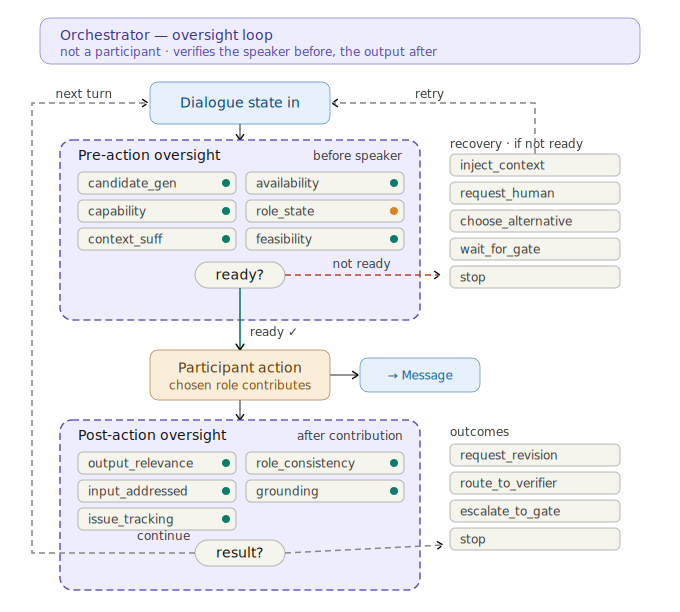
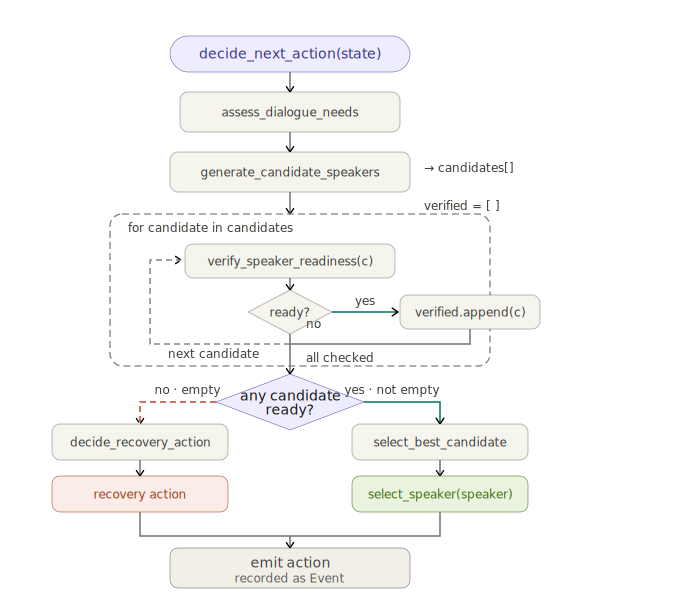

# Orchestrator

The orchestrator is what makes a DCP dialogue *controlled* rather than a free-for-all. 
It **drives** the conversation (who speaks next) and **oversees** every turn (is the speaker ready? is the output good?) — and it acts on what oversight finds. 
It is not a participant and holds no state that isn't in the log, so it can attach to, resume, or replay any instance.

## 1 · What it owns — and doesn't

| The orchestrator owns | It delegates |
|-----------------------|--------------|
| Turn serialization (one contribution per turn) | *Who* speaks / whether to stop → a **ControlPolicy** |
| Pre- and post-turn **oversight** and the recovery/routing it triggers | *Whether a turn is OK* → an **OversightPolicy** |
| Recovery, revision, verification, gates, termination priority | *The words of a turn* → a **ModelProvider** (the agent) |
| Emitting every state change to the append-only log (replay/resume) | *Human replies* → a **HumanGateway** |

The guiding rule is **"policy proposes, runtime disposes"**: a control policy returns an *intended* action, and the orchestrator still applies oversight, recovery, and termination around it. 
This is why a custom brain can be powerful *and* safe — you write one method, the runtime keeps the correctness-critical machinery.

## 2 · How you get one

```python
# Usual way — the Server facade builds and runs it for you (and auto-resumes a partway instance):
result = await server.run("demo", cast={"proposer": "proposer", "founder": "@alice"},
                          human_gateway=my_gateway)

# Full control — construct it directly:
from dcp.orchestration import Orchestrator
orch = Orchestrator(store=store, template=template, instance_id="demo",
                    cast={...}, participants={...}, provider=orchestrator_provider,
                    agent_providers={...}, oversight=my_oversight, control_policy=my_policy)
inst = await orch.run()
```

`server.run` derives each agent's provider from its `model_binding` (else the environment default), and **resumes** automatically if the instance is already partway through. 
Override with `orchestrator_provider` / `agent_providers` (e.g. a `MockProvider` in tests).

## 3 · The turn loop



Every turn runs the same cycle. Verification records are **not audit decoration** — the orchestrator routes on them.

**Select.** The `ControlPolicy` returns an `OrchestratorAction`: `select_speaker`, `stop`, or `suspend` (§4).

**Pre-action (speaker readiness).** Before a candidate speaks, a `PreActionVerification` scores `readiness`, `availability`, `capability_match`, `role_state`, `context_sufficiency`, `execution_feasibility` → a `recommended_action`. 
If it isn't `select_speaker`, the orchestrator performs the recovery (bounded by `max_recovery_attempts`):

- `inject_context` → add the missing context, retry the candidate
- `request_human` → solicit a human, inject the reply as context, retry
- `wait_gate` → block on the open gate(s) until resolved, retry
- `choose_alternative` → re-select a different candidate
- `stop` → terminate `provisional`

**Contribute.** The cast agent (or human, via the gateway) produces the turn; it is appended to the log as an immutable `Message`.

**Post-action (output verification).** A `PostActionVerification` gives a `verdict`(`pass`/`revise`/`escalate`/`reject`), quality dimensions (`relevance`, `role_consistency`, `completeness`, `grounding`, `safety`), and an `outcome` the orchestrator routes on:

- `continue` → next turn
- `request_revision` → same role revises as a new turn (bounded by `max_revisions`)
- `request_verification` → route a turn to a verifier role
- `escalate_gate` → open a human approval gate
- `stop` → terminate `done`

**Terminate.** Checked every turn in strict priority (§2.10): `error > budget > stopped > provisional > done`. 
`done` requires the termination condition satisfied **and** no open gate; every terminal status carries a reason and is emitted as `instance_terminated`.

## 4 · Control policies — the "brain"

Who decides each turn is a pluggable **`ControlPolicy`**: a single `async def decide(ctx)` that reads a read-only `DialogueContext` (the replayed state — transcript, roles, roster, turn, last speaker, the effective goal/termination/brief, plus the orchestrator's model provider) and returns an
`OrchestratorAction`.



**Built-ins**, chosen by `orchestration.mode`:

- **`PlanPolicy`** (`mode: plan`) — *emergent*. Asks the orchestrator's model for the next action, given the goal, roles, brief, and transcript. A declared `flow` is passed as an **advisory hint** the model may follow or override.
- **`FlowPolicy`** (`mode: flow`) — *guided*. Succession is constrained to the template's `flow` graph: deterministic where a role has one outgoing edge; the model chooses among the **allowed** roles at a branch. The flow is the *initial* order — the oversight loop may still adapt it.

**Custom** — implement `decide` and pass it to `Orchestrator(..., control_policy=...)` or `Server.run(..., control_policy=...)`. 
A trivial no-model example:

```python
from dcp.orchestration import DialogueContext, OrchestratorAction
from dcp.schema import TerminationStatus

class RoundRobinPolicy:
    """Each role speaks once, in template order, then stop — no model at all."""
    async def decide(self, ctx: DialogueContext) -> OrchestratorAction:
        spoken = {m.role_id for m in ctx.messages}
        for role in ctx.roles:
            if role.role_id not in spoken:
                return OrchestratorAction(action="select_speaker", target_role_id=role.role_id)
        return OrchestratorAction(action="stop", status=TerminationStatus.DONE)
```

A model-backed policy is just as small — call `ctx.provider.structured(...)` inside `decide` (that's exactly what `PlanPolicy` does). 
`suspend` pauses without terminating, so a later `run()` resumes.

## 5 · Oversight policies

Oversight runs before every turn (speaker readiness → recovery) and after (output quality → routing); the orchestrator acts on the records (§3). 
It is a pluggable **`OversightPolicy`**:

- **`DefaultOversight`** — passes everything (the key-free happy path).
- **`LlmOversight`** — asks the orchestrator's model for the verification records.
- **`ScriptedOversight`** — drives specific branches in tests.

**The easy custom way** — one function per dimension with `RubricOversight`:

```python
from dcp.orchestration import RubricOversight, CheckOutcome
from dcp.schema import Assessment

async def grounding(*, role, message, transcript) -> CheckOutcome:
    if "http" in message.content or "[" in message.content:   # crude "has a citation"
        return CheckOutcome(Assessment.OK)
    return CheckOutcome(Assessment.WEAK, "no source cited")

oversight = RubricOversight(grounding=grounding)   # unset dimensions default to ok
await server.run("demo", cast=..., oversight=oversight)
```

By default a safety failure escalates to a human gate, any other non-`ok` requests a revision, and an all-`ok` turn continues — override with `verdict_fn=...`. 
**The full-control way**: implement `pre` and `post` yourself (see `LlmOversight` for a reference).

## 6 · Build your own orchestrator

You never subclass the `Orchestrator` — its runtime (turn serialization, oversight, recovery, termination, replay) is fixed and correctness-critical. **Building your own orchestrator means composing it from your own brains:** a custom `ControlPolicy` (§4 — who speaks / when to stop) and, optionally, a custom `OversightPolicy` (§5 — what's acceptable). Hand them to `Server.run(...)` or `Orchestrator(...)`; the runtime does the rest ("policy proposes, runtime disposes").

Your `decide(ctx)` reads a rich, read-only `DialogueContext` — the replayed state — to make its call:

| From `ctx` | Use it to |
|-----------|-----------|
| `goal` · `brief` · `termination_condition` | know the run's intent (especially for a model-backed brain) |
| `roles` · `roster` · `filled_role_ids()` | know the seats and who is cast |
| `messages` · `transcript()` · `last_speaker` | see what's been said; alternate or route |
| `turn` · `max_turns` · `over_turn_cap()` · `budget` | respect the budget |
| `rejected_this_turn` | skip candidates a pre-check just found unavailable |
| `provider` | call `ctx.provider.structured(...)` for a model-backed decision |

```python
class ModeratedDebatePolicy:
    """Alternate two debaters for N rounds each, then let the judge close — no model needed."""
    def __init__(self, *, debaters, judge, rounds=2):
        self._debaters, self._judge, self._rounds = debaters, judge, rounds
    async def decide(self, ctx):
        counts = Counter(m.role_id for m in ctx.messages)
        owed = [d for d in self._debaters if counts[d] < self._rounds]
        if owed:                                                # least-spoken, avoid the last speaker
            return OrchestratorAction(action="select_speaker",
                                      target_role_id=min(owed, key=lambda d: (counts[d], d == ctx.last_speaker)))
        if counts[self._judge] == 0:
            return OrchestratorAction(action="select_speaker", target_role_id=self._judge)
        return OrchestratorAction(action="stop", status=TerminationStatus.DONE)

await server.run("demo", cast=..., control_policy=ModeratedDebatePolicy(
    debaters=("optimist", "skeptic"), judge="judge"))   # + oversight=… for a custom verification brain
```

The full runnable version (with a commented model-backed `decide` that calls `ctx.provider.structured`) is [`orchestrator_build_own.py`](examples/orchestrator_build_own.py). For a custom orchestrator in a real system, see the [research-companion walkthrough](walkthrough-research-companion.md).

## 7 · Share a policy

A `ControlPolicy` or `OversightPolicy` ships like any component — declare a `dcp.control_policies` / `dcp.oversight_policies` entry point (or a portable component manifest) so others resolve it by name.
See [07 · Extending & Sharing](07-extending-sharing.md).

## Runnable examples

Deterministic, key-free (`MockProvider`) — each maps to a section above:

| Example | Shows |
|---------|-------|
| [`orchestrator_run_vs_manual.py`](examples/orchestrator_run_vs_manual.py) | §2 — `Server.run` auto-creation vs. building `Orchestrator(...)` by hand |
| [`orchestrator_control_policy.py`](examples/orchestrator_control_policy.py) | §4 — `PlanPolicy`, `FlowPolicy`, and a custom policy |
| [`orchestrator_oversight.py`](examples/orchestrator_oversight.py) | §3/§5 — `Default`/`Rubric`/`Scripted` oversight + the full turn workflow (select → pre → recovery → contribute → post → revision → stop) printed from the event log |
| [`orchestrator_build_own.py`](examples/orchestrator_build_own.py) | §6 — build your own orchestrator: a custom debate-moderator `ControlPolicy` that reads the `DialogueContext` |
| [`orchestrator_share_policy.py`](examples/orchestrator_share_policy.py) | §7 — load a shared `ControlPolicy` by name from a plugin (`pip install -e examples/plugin-example` first) |

---

**Next:** [05 · Participant](05-participant.md) — who takes the turns, and how their models are bound. · [All docs](README.md)
