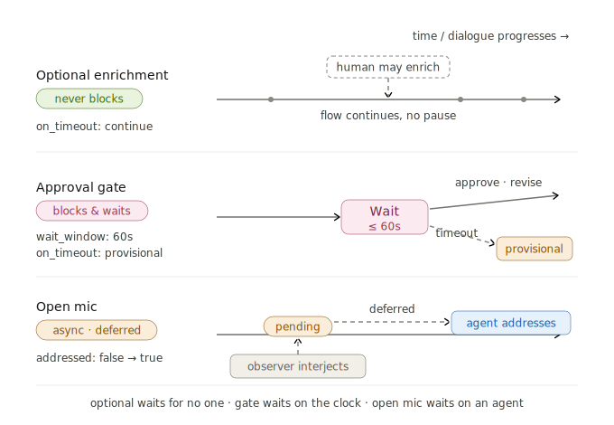

# Participant

A **Role** is a seat in a template; a **Participant** is a real registered identity — an agent or a human — **cast into** that seat for one run. 
This doc covers both kinds: how humans take part, how agents are backed by models, and the relationship between an agent and the orchestrator.

```python
from dcp import schema as s

server.register_participant(s.Participant(participant_id="proposer", kind=s.RoleKind.AGENT,
                                          display_name="Proposer"))
server.register_participant(s.Participant(participant_id="@alice", kind=s.RoleKind.HUMAN,
                                          display_name="Alice"))
```

At run time you **cast** roles to participants: `cast={"proposer": "proposer", "approver": "@alice"}`
(`role_id → participant_id`).

## 1 · Human participants

Humans are first-class turn-takers, not a bolt-on. 
How a human participates is set by the **role's** `response_requirement`:



| Mode | `response_requirement` | Waits? | Config |
|------|------------------------|--------|--------|
| Optional enrichment | `optional` | no | continues if silent |
| Required input | `required` (human role) | yes | `wait_window_seconds`, `on_timeout` |
| Approval gate | `gate` | yes | `wait_window_seconds`, `on_timeout` |
| Open mic | any `observe`-tier participant, if `template.allow_open_mic` | — | pending until addressed |

A waited human that times out resolves per `on_timeout` (default `finalize_provisional`), so an unresponsive human never hangs the instance. 
Replies come through a **`HumanGateway`** you pass to `run` — `ScriptedHumanGateway` for non-interactive/test runs, or your own for a real UI:

```python
from dcp.orchestration import HumanReply, ScriptedHumanGateway
gw = ScriptedHumanGateway({"approver": HumanReply(content="Approved.", decision="approve")})
await server.run("demo", cast=..., human_gateway=gw)
```

**Joining, mid-flight, leaving.** In a hosted server, other people join an instance subject to visibility + access tier, and receive the full replayed history on join; they can leave; an `observe`-tier participant may **open-mic** if the template allows it. Those hosting mechanics — `grant_access` / `join` / `leave`, tiers, visibility — live in [06 · Hosting & Delivery](06-hosting-delivery.md#access-control).

## 2 · Agent participants & their models

An agent participant is backed by a **`ModelProvider`** — any object with async `text(...)` and `structured(...)`. 
You bind one to an agent declaratively via `model_binding` (D8):

```python
server.register_participant(s.Participant(
    participant_id="critic", kind=s.RoleKind.AGENT, display_name="Critic",
    model_binding=s.ModelBinding(provider="anthropic", model="claude-opus-4-8")))
```

`ModelBinding` has **no credential field** — the key is resolved from the environment by `provider` (never stored in a binding). 
`model_binding` is only valid on agent roles; a human participant never carries one.

### Provider taxonomy

| Provider | Kind | Select with | Needs |
|----------|------|-------------|-------|
| `openai` | Hosted API | `ModelBinding(provider="openai", model="gpt-5.4")` | `OPENAI_API_KEY` |
| `anthropic` | Hosted API | `ModelBinding(provider="anthropic", model="claude-opus-4-8")` | `ANTHROPIC_API_KEY` |
| `local` | Your OpenAI-compatible **server** (vLLM / Ollama / LM Studio) | `ModelBinding(provider="local", model="llama3.1", base_url="http://localhost:11434/v1")` | an endpoint; usually no key; no extra |
| `transformers` | **In-process** open-weights (e.g. Qwen3) via HuggingFace | `ModelBinding(provider="transformers", model="Qwen/Qwen3-4B")` | `pip install -e "./sdk[transformers]"`; no key, no server |
| a **remote component** agent | An agent someone else **hosts**; you connect over HTTP | resolve/connect a component (§ below) | the endpoint + any token — see [07](07-extending-sharing.md) |
| `mock` | Scripted, deterministic | `MockProvider(texts=[...])` | nothing — the key-free path |

Discover what a server has configured (a key present / `DCP_BASE_URL` set / the extra installed) without exposing secrets:

```python
for p in server.server_info().model_providers:
    print(p.provider, "configured" if p.configured else "—")
```

### Choosing providers — three levels of override

The orchestrator resolves each agent's provider in this precedence:

| Precedence | Mechanism | Scope |
|------------|-----------|-------|
| 1 (highest) | `run(agent_providers={pid: <instance>})` | one participant, this run |
| 2 | `Participant.model_binding` (declarative, D8) | that agent, everywhere it plays |
| 3 (fallback) | env `DCP_MODEL_PROVIDER` / `DCP_MODEL` | orchestrator + any unbound agent |

Because resolution is per-agent, **one dialogue can mix providers** — a Claude proposer and a GPT critic and a local-model summarizer, all in the same run.
Mixing `openai` + `anthropic` just means both keys must be in the environment. The orchestrator itself uses `orchestration.model_binding` (if the template sets one) else the env default; override per run with `orchestrator_provider=`.

### Bring your own agent

Any object with async `text`/`structured` is a provider — that is how you plug in your own agent:

```python
class LabProvider:
    def __init__(self, model: str = "lab-7b") -> None:
        self.model = model
    async def text(self, *, instructions: str, content: str) -> str:
        ...   # call your model, return the contribution
    async def structured(self, *, instructions, content, schema):
        ...   # return a validated `schema` instance (used for decisions/oversight)

await server.run("demo", cast=..., agent_providers={"proposer": LabProvider()})
```

Packaged under a `dcp.providers` entry point, a provider **resolves by name**, so `ModelBinding(provider="lab_llm", …)` just works — see [07 · Extending & Sharing](07-extending-sharing.md#share-an-agent).
A provider that only ever *speaks* may implement `text` and leave `structured` unsupported.

## 3 · Agent ≠ Orchestrator

A common confusion worth stating plainly:

- The **orchestrator** decides *who* speaks and *whether the turn is acceptable* (control + oversight). One per instance. See [04 · Orchestrator](04-orchestrator.md).
- An **agent** produces *the words of its own turn* when selected. Many per instance.

They may even use the same model, but they are different roles in the system: the orchestrator is the director; agents are the cast.

---

**Next:** [06 · Hosting & Delivery](06-hosting-delivery.md) — register, admit, and serve participants to many users. · [All docs](README.md)
