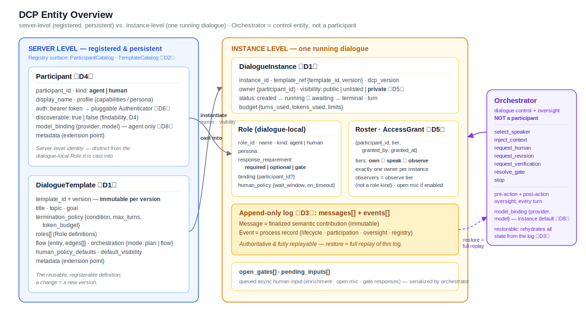
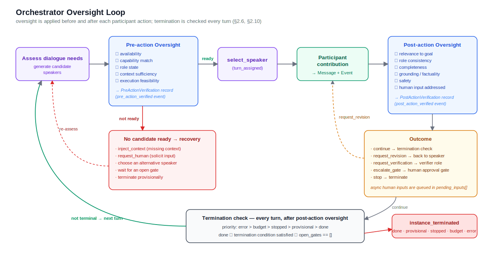
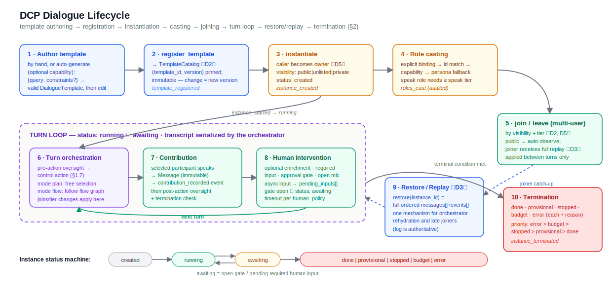
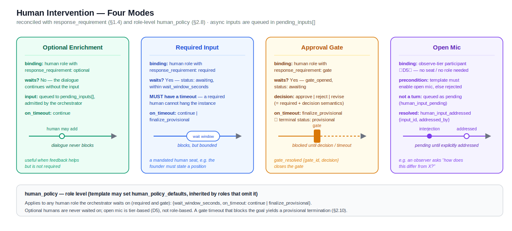
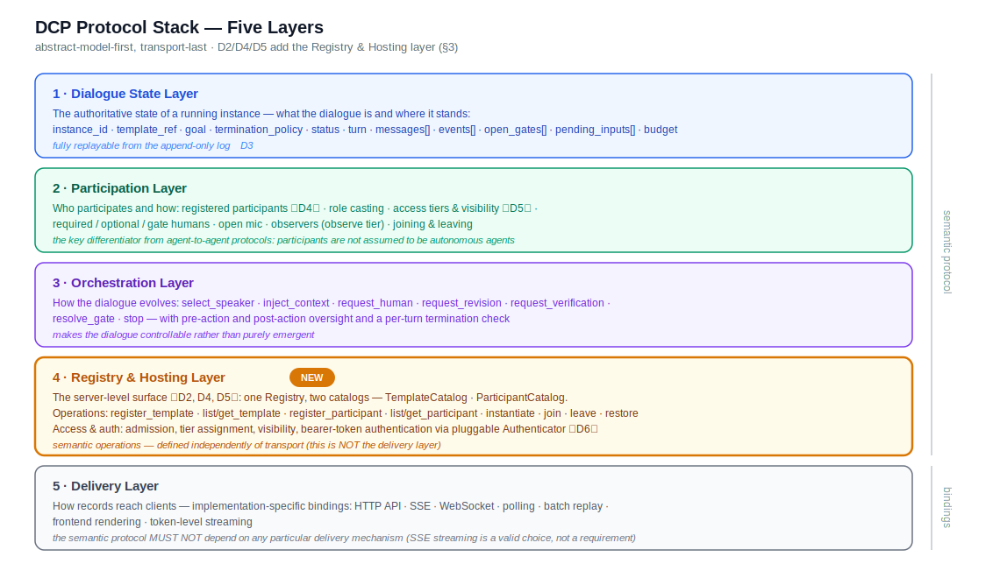

# A Dialogue-centric Protocol (DCP) for Human-Agent Multi-Agent Systems

DCP is a **standalone**, **dialogue-centric**, **server-hosted** protocol for systems in which
many participants — LLM agents **and** real humans — collaborate in a shared, controlled, and
fully replayable conversation. A central **orchestrator** both *drives* the dialogue (who speaks
next) and *oversees* it (verifying every turn before and after it happens).

This document is the **design narrative**: the entities, the lifecycle, and the layering, with
rationale and illustrative JSON. The **normative** contract — field tables, RFC-2119 requirements,
conformance criteria — lives in [`SPEC.md`](SPEC.md); the Pydantic models in `sdk/src/dcp/schema/`
are the authoritative machine-readable definition, and a reference Python SDK implements the whole
protocol (`sdk/`).

> **Reference protocols** — MCP, A2A, ACP, ANP, agents-json — were studied only for *method* (how a
> spec is authored, how schemas are organized, how an SDK is shipped), never for design. No entity,
> field, verb, or lifecycle from another protocol enters DCP; everything below is derived from DCP's
> own model and the foundational decisions D1–D11.

---

## 0. Classification

| Axis | DCP |
|------|-----|
| **Counterparty** | Hybrid — human-agent / agent-agent / orchestrator-agent |
| **Payload** | Hybrid — message + control action + state/event + human signal + artifact/context |
| **Interaction state** | Stateful — a running instance has authoritative, replayable state |
| **Discovery** | Centralized / platform-mediated — a DCP **server** hosts a registry |
| **Schema flexibility** | Multiple predefined schemas plus declared, typed extension points |

## 0.1 Foundational decisions

Everything in this document follows from a small set of firm design decisions:

- **D1 — Template vs Instance.** A **DialogueTemplate** is the reusable, registerable *definition*;
  a **DialogueInstance** is a running occurrence *created from* it, carrying live state.
- **D2 — Server-hosted.** A DCP **server** hosts dialogues: templates are registered, instances are
  addressable and joinable. `register / discover / instantiate / join / leave` are *semantic*
  operations, independent of transport.
- **D3 — Restore = full replay.** An instance persists its full history; the orchestrator (and any
  late joiner) rehydrates by replaying the append-only log. No authoritative state exists outside
  the log.
- **D4 — Humans are registered participants**, like agents — a server-level identity with auth, a
  profile, and a discoverability flag, distinct from the dialogue-local Role they are cast into.
- **D5 — Access control.** Each instance has an **owner**; participants hold one tier —
  `own ⊃ speak ⊃ observe`; instances have **visibility** `public | unlisted | private`.
- **D6 — Auth.** A bearer token resolves to one participant via a pluggable `Authenticator` (with an
  anonymous dev mode). Auth proves *who you are*; tiers decide *what you may do*.
- **D7/D8 — Model binding is per-consumer.** A `ModelBinding {provider, model}` attaches separately
  to the orchestrator and to each agent participant, so one dialogue MAY mix providers/models.
- **D9 — ServerInfo & capabilities.** A server advertises its protocol version, enabled
  capabilities, and available model providers.
- **D10 — Auto-generation is a standalone generator**, not an orchestrator action: *query → draft
  template → (edit) → register → instantiate → run*.
- **D11 — Oversight governs control.** Pre/post verification records are not audit decoration; the
  orchestrator **acts on them** — recovery before a turn, routing after it.

---

## 1. Core Entities



DCP separates **server-level** entities (persistent, registered) from **instance-level** entities
(scoped to one running dialogue). The **Orchestrator** is a control entity, not a participant.

```
Server-level:    Participant (registered)      DialogueTemplate (registered)
Instance-level:  DialogueInstance ── Role ──(cast to)── Participant
                      │  Message   Event   AccessGrant
                      └─ driven + overseen by → Orchestrator (control + oversight)
```

### 1.1 DialogueTemplate  〔D1〕

The reusable, registerable **definition** of a dialogue: its roles, how it ends, and how it is
orchestrated. A template is **immutable** once registered under a `(template_id, version)` — a
change is a new version.

```json
{
  "template_id": "design-review",
  "version": "1.0.0",
  "title": "Product-name design review",
  "topic": "product naming",
  "goal": "Agree on a product name the founder approves.",
  "termination_policy": { "condition": "founder approves", "max_turns": 12 },
  "roles": [ /* … see §1.3 … */ ],
  "flow": { "entry": "proposer", "edges": [] },
  "orchestration": { "mode": "plan" },
  "human_policy_defaults": { "wait_window_seconds": 60, "on_timeout": "finalize_provisional" },
  "default_visibility": "private",
  "allow_open_mic": false
}
```

Templates may be authored by hand or auto-generated from a query (§2.2). Because the template is
separate from the instance (D1), one definition can be reused to spawn many independent dialogues.

### 1.2 DialogueInstance  〔D1〕

A running occurrence created from a template, carrying **all runtime state**. Its authoritative
state is a deterministic replay of the append-only log (D3), so nothing here lives only in memory.

```json
{
  "instance_id": "dlg_001",
  "template_ref": { "template_id": "design-review", "version": "1.0.0" },
  "owner": "@founder",
  "visibility": "private",
  "dcp_version": "0.2.0",
  "status": "running",
  "turn": 4,
  "roster": [
    { "participant_id": "@founder", "tier": "own", "role_id": "founder" },
    { "participant_id": "agent.proposer.v1", "tier": "speak", "role_id": "proposer" }
  ],
  "messages": [ /* finalized contributions */ ],
  "events":   [ /* process records */ ],
  "open_gates": [],
  "pending_inputs": [],
  "budget": { "turns_used": 4, "tokens_used": 3200, "max_turns": 12 }
}
```

**`status`** is a first-class enum: `created` → `running` → `awaiting` (blocked on a gate or a
required human input) ⇄ `running`, plus the terminal states of §2.10. An instance is **resumable**
iff its status is non-terminal.

### 1.3 Role

A **dialogue-local identity** defined by a template and filled at runtime by *casting* (§2.4). The
same participant may fill different roles across instances, and a role's semantics survive even if
the underlying participant changes.

```json
{
  "role_id": "founder",
  "name": "Founder",
  "kind": "human",
  "persona": "Approves or rejects the chosen name.",
  "response_requirement": "gate",
  "binding": { "participant_id": "@founder" },
  "human_policy": { "wait_window_seconds": 60, "on_timeout": "finalize_provisional" }
}
```

- **`kind`** ∈ `{agent, human}`. Observers are not a role kind — they are the `observe` access tier
  (§1.8).
- **`response_requirement`** ∈ `{required, optional, gate}` — the orchestrator's per-role
  wait/mandate policy:
  - `required` — when selected, the participant must contribute; the orchestrator waits. A
    **required human** waits within its `human_policy` window and applies `on_timeout`, so it can
    never hang the instance.
  - `optional` — may contribute; the orchestrator does not wait (Optional Enrichment, §2.8).
  - `gate` — a human **approval gate**: required *plus* approve/reject/revise decision semantics.
- **`binding`** names the intended participant (`{participant_id}`), or is empty to be cast by
  capability/persona.

### 1.4 Participant (registered)  〔D4〕

A **server-level persistent identity** — human or agent — registered to the server. This is where
DCP departs most from agent-to-agent protocols: humans are first-class registered identities, not
ad-hoc handles.

```json
{
  "participant_id": "agent.proposer.v1",
  "kind": "agent",
  "display_name": "Proposer",
  "profile": "Proposes candidate product names with a one-line rationale.",
  "discoverable": true,
  "model_binding": { "provider": "openai", "model": "gpt-5.4" }
}
```

- **`profile`** is the self-description (capabilities / persona), distinct from a dialogue-local Role.
- **`discoverable`** governs whether others can find it to invite it (findability), independent of
  what it may *do* in an instance (that is the access tier, §1.8).
- **`model_binding`** (agent-kind only, D8) is the model that produces *this agent's* contributions,
  independent of the orchestrator's binding — so different agents in one dialogue MAY run on
  different providers/models. Credentials resolve by provider from the environment, never stored in
  the binding.

### 1.5 Orchestrator — control + oversight

The orchestrator is responsible for both **dialogue control** and **dialogue oversight**. It is
*not* a participant and contributes no content. Oversight is applied **before and after every
participant action**, and — crucially (D11) — the orchestrator **acts on** what oversight finds.



**Control actions.** Each turn the orchestrator emits one control action:

```text
select_speaker · inject_context · request_human · request_revision
              · request_verification · resolve_gate · stop
```

In `plan` mode it selects the next speaker freely; in `flow` mode it follows the template's declared
graph.

**Pre-action oversight (speaker readiness).** Before a candidate speaks, the orchestrator verifies
it — availability, capability match, role state, context sufficiency, execution feasibility — and
produces a `PreActionVerification`:

```json
{
  "readiness": "not_ready",
  "availability": "available",
  "capability_match": "high",
  "role_state": "needed",
  "context_sufficiency": "insufficient",
  "execution_feasibility": "feasible",
  "issues": [
    { "type": "missing_context", "description": "Needs the implementation constraints first." }
  ],
  "recommended_action": "inject_context",
  "recovered": true
}
```

If the recommendation is not `select_speaker`, the orchestrator performs the **recovery** (bounded
by `max_recovery_attempts`) rather than proceeding:

- `inject_context` → add the missing context, retry the candidate;
- `request_human` → solicit a human, inject the reply as context, retry;
- `wait_gate` → block on the open gate(s) until they resolve, retry;
- `choose_alternative` → re-select a different candidate;
- `stop` → terminate `provisional`.

**Post-action oversight (output verification).** After a contribution, the orchestrator verifies it
and produces a `PostActionVerification`:

```json
{
  "verdict": "revise",
  "relevance": "ok",
  "role_consistency": "ok",
  "completeness": "weak",
  "grounding": "ok",
  "safety": "ok",
  "human_input_addressed": true,
  "issues": [ { "type": "incomplete", "description": "Risks section is thin." } ],
  "outcome": "request_revision",
  "escalated": false
}
```

It then **routes** on the outcome:

- `continue` → next turn;
- `request_revision` → the same role revises as a new turn (bounded by `max_revisions`);
- `request_verification` → route a turn to a verifier role;
- `escalate_gate` → open a human approval gate;
- `stop` → terminate `done`.

Reference control loop (informative):

```python
def take_turn(state):
    role = decide_next_speaker(state)            # plan: free | flow: graph
    pre  = verify_readiness(role, state)         # pre-action oversight
    if not pre.ready:
        return recover(pre.recommended_action)   # inject_context / request_human / wait_gate / …
    contribution = role.contribute(state)        # Message + Event
    post = verify_output(contribution, state)    # post-action oversight
    return route(post.outcome)                   # continue / revise / verify / escalate / stop
```

Because the orchestrator holds no state that is not reconstructable from the log (D3), it can attach
to a running or resumed instance and rehydrate by full replay (§2.9).

### 1.6 Message

A **finalized semantic contribution** to the transcript — append-only and immutable once recorded.

```json
{
  "message_id": "msg_004",
  "instance_id": "dlg_001",
  "turn_id": 4,
  "role_id": "technical_critic",
  "participant_id": "agent.technical.v1",
  "speaker_kind": "agent",
  "content": "The main technical risk is the dependency on reliable orchestration decisions.",
  "created_at": "…",
  "metadata": { "model": "gpt-5.4" }
}
```

### 1.7 Event

A protocol-level record that **something happened** — a state transition, a control decision, a
participation signal. The persisted `messages[] + events[]` are the authoritative, replayable log.

```json
{
  "event_id": "evt_012",
  "instance_id": "dlg_001",
  "type": "turn_assigned",
  "payload": { "target_role_id": "technical_critic", "turn": 4 },
  "created_at": "…"
}
```

Event types are grouped: *registry* (`template_registered`, `participant_registered`), *instance
lifecycle* (`instance_created`, `instance_started`, `turn_assigned`, `contribution_recorded`,
`instance_terminated`), *participation* (`roles_cast`, `participant_joined/left`, `tier_changed`,
`human_input_pending/addressed`, `gate_opened/resolved`), and *oversight* (`pre_action_verified`,
`post_action_verified`, `revision_requested`, `verification_requested`, `context_injected`).

### 1.8 Access & Identity  〔D5, D6〕

Each instance has exactly one **owner** (the participant that instantiated it). Every participant
holds one **access tier**:

```text
own  ⊃  speak  ⊃  observe
own     — manage access & visibility, invite, assign/revoke tiers, terminate, transfer ownership
speak   — may be cast into a role and contribute messages
observe — read-only transcript; may open-mic only if the template enables it
```

An **AccessGrant** `{instance_id, participant_id, tier, granted_by, granted_at}` records an admission.
**Visibility** governs joining: `public` (open-join as observe), `unlisted` (join by id/link with a
grant), `private` (invite-only; default).

**Auth** resolves a bearer token to one `participant_id` through a pluggable `Authenticator`; a
built-in anonymous dev mode keeps the local hello-world key-free. Auth answers *who you are*; tiers
answer *what you may do*.

### 1.9 ServerInfo & Capabilities  〔D9〕

A server advertises what it can do, so a client can discover — before acting — its protocol version,
enabled capabilities, and available model providers (credentials are never exposed, only a boolean):

```json
{
  "dcp_version": "0.2.0",
  "capabilities": { "auto_generate": true, "verifier_routing": false },
  "model_providers": [
    { "provider": "openai", "configured": true },
    { "provider": "anthropic", "configured": false },
    { "provider": "mock", "configured": true }
  ]
}
```

---

## 2. Dialogue Lifecycle



```
author template → register → (optional auto-generate) → instantiate → cast roles
→ join / leave → turn orchestration → contribution → human intervention → restore/replay → terminate
```

### 2.1 Template authoring & registration  〔D1, D2〕

A template is authored (by hand or auto-generated) and **registered** to the server. Registration
pins `(template_id, version)`, which is **immutable** — re-registering the same id with different
content must use a new version. Emits `template_registered`.

### 2.2 Auto-generation: query → draft template  〔D10〕

Optionally, the server generates a template from a natural-language query. This is a **standalone,
model-backed generator**, deliberately *not* an orchestrator action: authoring is an upstream,
instance-less step, whereas the orchestrator controls a *running* instance. Its contract is
`{query, constraints?}` → a **valid DialogueTemplate** the user may edit and register.

```json
{ "query": "A debate between an optimist and a skeptic about a launch plan." }
```

The output is a **draft** (unregistered); the pipeline is always *query → draft → (edit) → register
→ instantiate → run*. A server without this capability rejects the request with a capability error.

### 2.3 Instantiation  〔D1, D2, D5〕

`instantiate(template_ref, {owner, visibility?})` creates a **DialogueInstance** in status
`created`, sets the caller as **owner**, and seats it at the `own` tier. Emits `instance_created`;
the first control action transitions the instance to `running`.

### 2.4 Role casting

Casting binds each template Role to a registered Participant, by precedence:

```text
explicit binding → role_id matches a registered participant id → capability overlap → persona fallback
```

A participant cast into a `speak`-capable role must hold ≥ `speak` tier. Casting is recorded
(`roles_cast`) for auditability.

```json
{
  "type": "roles_cast",
  "instance_id": "dlg_001",
  "roles": [
    { "role_id": "proposer", "participant_id": "agent.proposer.v1" },
    { "role_id": "founder",  "participant_id": "@founder" }
  ]
}
```

### 2.5 Joining & leaving (multi-user)  〔D2, D5〕

Other participants may `join` an instance subject to visibility + tier: `public` → auto `observe`;
`unlisted`/`private` → requires a grant from an `own`/invite holder. `join` emits
`participant_joined` and triggers a **restore/replay** so the joiner receives the full log to date
(D3). Joins and leaves take effect **between turns** — they never mutate a turn in flight.

### 2.6 Turn orchestration

Each turn the orchestrator emits one control action (§1.5), preceded by pre-action oversight and
(after a contribution) followed by post-action oversight, then a termination check.

- **Serialized transcript.** The transcript is a single serialized sequence even with many
  participants: the orchestrator admits at most **one contribution per turn**. Asynchronous human
  inputs (optional enrichment, open-mic, gate replies) queue into `pending_inputs[]`; joins/leaves
  and tier changes apply between turns. This keeps a coherent, replayable transcript under
  multi-user async participation.
- **`orchestration.mode`** ∈ `{plan, flow}`: `plan` selects the next speaker freely (emergent);
  `flow` follows the template's declared `flow` graph (deterministic). `flow` is advisory under
  `plan` and binding under `flow`.

### 2.7 Participant contribution

The selected participant contributes; the finalized contribution becomes a **Message** and the act
of recording it is an **Event** (`contribution_recorded`).

```json
{ "role_id": "founder", "speaker_kind": "human",
  "content": "I approve, but make the risk section more concrete.",
  "metadata": { "mode": "gate", "decision": "approve" } }
```

### 2.8 Human intervention



Human participation takes four forms, selected by a role's `response_requirement` (plus, for
open-mic, the template's `allow_open_mic`):

| Mode | Bound to | Waits? | Config |
|------|----------|--------|--------|
| **Optional enrichment** | human role, `response_requirement: optional` | No | `on_timeout: continue` |
| **Required input** | human role, `response_requirement: required` | Yes (`awaiting`) | `wait_window_seconds`, `on_timeout` |
| **Approval gate** | human role, `response_requirement: gate` | Yes (`awaiting`) | `wait_window_seconds`, `on_timeout` |
| **Open mic** | any `observe`-tier participant, if `template.allow_open_mic` | — | pending until addressed |

`human_policy` lives at role level (with template `human_policy_defaults`) and applies to **any**
waited human — required *and* gate — so an unresponsive human can never hang the instance
(`on_timeout` defaults to `finalize_provisional`). Open-mic input is marked pending until a
participant addresses it (`human_input_addressed`); it is rejected unless the template opts in via
`allow_open_mic`.

### 2.9 Restore & replay  〔D3〕

`restore(instance_id)` returns the **full replayed log** (`messages[] + events[]` in order), from
which the orchestrator rehydrates its oversight state and a late joiner catches up — **one mechanism
for both**. Restore is full replay, not snapshot+delta. **Resume** = restore *then continue*: an
orchestrator attaching to a non-terminal instance rehydrates turn/transcript/roster and continues to
a terminal status without re-emitting the bootstrap events.

### 2.10 Termination

A dialogue terminates under exactly one terminal status, evaluated each turn in **priority order**:

```text
error  >  budget  >  stopped  >  provisional  >  done
```

| Status | Meaning |
|--------|---------|
| `done` | termination condition satisfied and no gate open |
| `provisional` | provisional result (e.g. a human gate timed out, or recovery was exhausted) |
| `stopped` | turn cap (`max_turns`) reached |
| `budget` | token/compute budget reached |
| `error` | runtime error (e.g. a participant could not be invoked) |

`done` requires the orchestrator to judge the condition satisfied **and** `open_gates == []`. Every
termination emits `instance_terminated` with a reason.

---

## 3. Protocol Layers

DCP is organized into **five layers**, ordered abstract-model-first and transport-last. Each layer
maps to a subpackage of the reference SDK.



### 3.1 Dialogue State Layer

The authoritative state of a running instance: `instance_id`, `template_ref`, `goal`, `topic`,
`termination_policy`, `status`, `turn`, `messages[]`, `events[]`, `open_gates[]`, `pending_inputs[]`,
`budget`. Defines *what a dialogue is and where it stands* — fully replayable from the append-only
log (D3).

### 3.2 Participation Layer

Who participates and how: registered participants (D4), role casting, access tiers & visibility
(D5), the four human-intervention modes, approval gates, open mic, observers. This is the primary
differentiator from agent-to-agent protocols — participants are **not** assumed to be autonomous
agents; humans can be required, optional, supervisory, or spontaneous.

### 3.3 Orchestration Layer

How a dialogue evolves: the control actions of §1.5, pre/post-action oversight, context injection,
revision/verification routing, gate resolution, open-mic addressing, and termination checking. This
layer makes the dialogue **controllable** rather than purely emergent — important when unconstrained
agent discussion would become repetitive, unbalanced, or misaligned with the goal.

### 3.4 Registry & Hosting Layer  〔NEW — D2, D4, D5, D6〕

The server-level surface that hosts dialogues:

- **Registries** — one Registry surface over two catalogs: a **TemplateCatalog** and a
  **ParticipantCatalog**. Operations: `register_template`, `list_templates`, `get_template`,
  `register_participant`, `list_participants`, `get_participant`, `instantiate`, `list_instances`,
  `get_instance`, `join`, `leave`, `restore`, `resume`, `server_info`, and `generate_template` (if
  enabled). Discovery exposes only `discoverable` participants and non-`private` templates/instances.
- **Access & auth** (D5/D6) — admission, tier assignment, visibility, and bearer-token
  authentication via the pluggable `Authenticator`.

These are **semantic** operations, independent of transport — they are not the Delivery layer.

### 3.5 Delivery Layer

How records reach clients: HTTP API, SSE, WebSocket, polling, batch replay, frontend rendering,
token-level streaming. This layer is **implementation-specific** — the semantic protocol must not
depend on any particular delivery mechanism. The reference SDK ships an HTTP + SSE binding
(replay-then-tail, so a subscriber receives the full history then live events), but SSE token
streaming is a valid choice, not a requirement.

---

## Status & references

- **Normative specification:** [`SPEC.md`](SPEC.md) — field tables, RFC-2119 requirements,
  conformance criteria (v0.2.0-draft).
- **Reference SDK:** [`sdk/`](sdk/) — a Python package (`dcp`) implementing all five layers, with a
  key-free hello-world and a conformance suite. See the [`README.md`](README.md) and the guides in
  [`docs/`](docs/).
- **Method references:** [`research/`](research/) and [`methodology/`](methodology/) — how mature
  protocols are authored/shipped (method only; no design borrowed).
